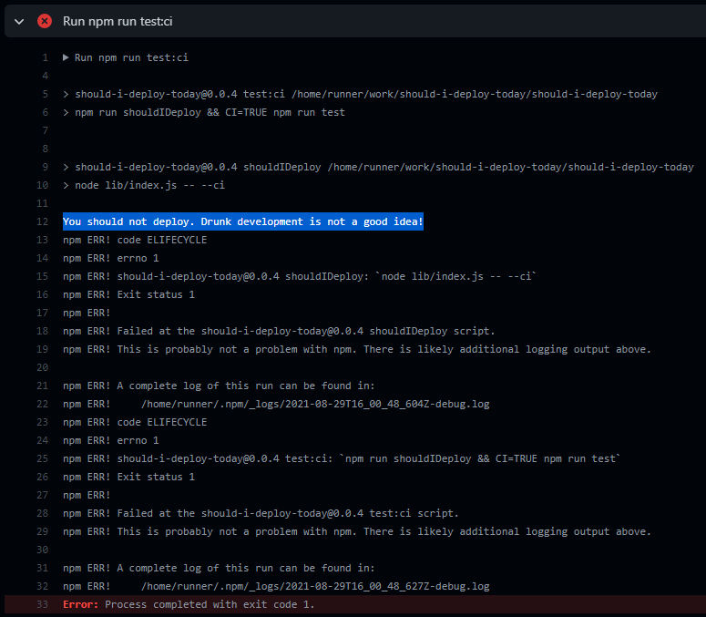

# Should I deploy today CI/CD

> Should I deploy today? Use it in your CI/CD environment or simply for fun.

| Statements                                                                    | Branches                                                                                       | Functions                                                                          | Lines                                                               |
| ----------------------------------------------------------------------------- | ---------------------------------------------------------------------------------------------- | ---------------------------------------------------------------------------------- | ------------------------------------------------------------------- |
|  |  |  |  |

---

## Table of Contents

- [Running example](#running-example)
- [Requirements](#requirements)
- [Installation](#installation)
- [Simple Usage](#simple-usage)
- [Advanced Usage](#advanced-usage)
- [Contributors](#contributors)
- [License](#license)

## Practical example



---

## Installation

- Install the library in your project as a devDependency:

```bash
  npm i -D should-i-deploy-today
```

---

## Simple Usage

- Simply run it from the CLI as follows to see whether you should or should not deploy today:

```bash
  npm run should-i-deploy-today
```

---

## Advanced Usage

- Want it to throw an error on your CI/CD environment? Use **--ci** argument:

```bash
  npm run should-i-deploy-today --ci
```

- You may also use **CI=true** instead:

```bash
  CI=true npm run should-i-deploy-today --ci
```

> Output example from a [pipeline](https://github.com/olavoparno/should-i-deploy-today/runs/3455432573?check_suite_focus=true) run on Sunday:

```shell
  You should not deploy. I see you deployed on Friday
  npm ERR! code ELIFECYCLE
  npm ERR! errno 1
  npm ERR! should-i-deploy-today@1.0.0 start: `npm run shouldIDeploy`
  npm ERR! Exit status 1
```

---

- Want it without logging? Try silent mode with **--silent** argument (note this only works alongside CI option):

```bash
  npm run should-i-deploy-today --ci --silent
```

> Output example with --silent option (only throws without logging the message):

```shell
  npm ERR! code ELIFECYCLE
  npm ERR! errno 1
  npm ERR! should-i-deploy-today@1.0.0 start: `npm run shouldIDeploy`
  npm ERR! Exit status 1
```

---

## License

should-i-deploy-today is [MIT licensed](./LICENSE).
